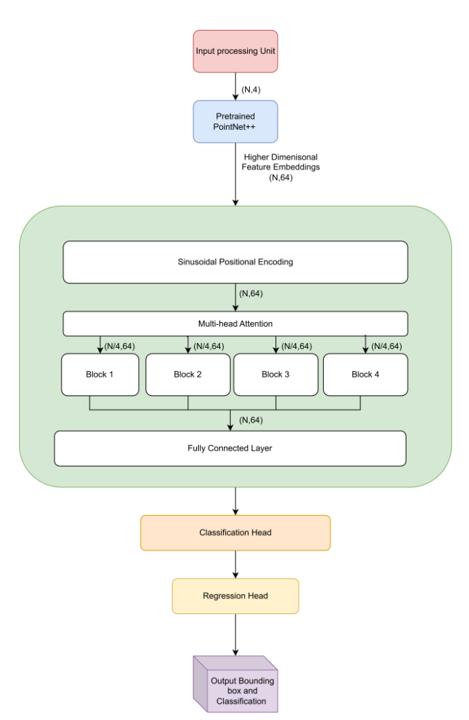
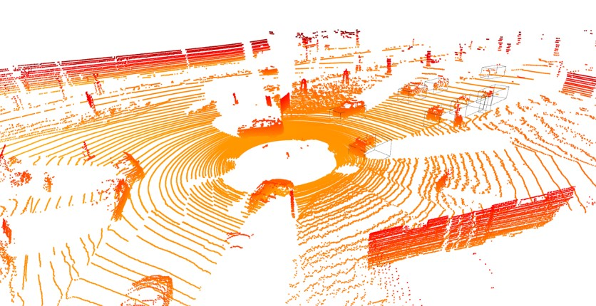

# Custom Transformer Model for 3D Object Detection

This project is dedicated to 3D object detection using **3D perception data** from the KITTI dataset. The workflow includes data preprocessing, model training, and visualization of the results.

## Model Architecture

The following image provides an overview of the **Transformer-based 3D Object Detection Model** used in this project:



Additionally, the image below illustrates the detected 3D objects:



### Key Components of the Model:
- A **pretrained PointNet++** encoder for extracting high-dimensional features.
- **Multi-head attention blocks** to capture spatial relationships in 3D data.
- **Fully connected layers** for classification and bounding box regression.
- Model outputs include **bounding boxes and classification labels**.

## Models

All models are stored in the `Networks` folder. The final implementation is in `network5.py`.
You can customize the architecture, including the number of attention heads and blocks, by modifying this file.

## Training

The model training process is handled by `training3.py`, which includes both training and validation using the KITTI dataset.

### Training the Model

1. Ensure all necessary dependencies are installed.
2. Download the KITTI dataset by running `download_kitti_dataset.py`.
3. Start training using the command:

   ```bash
   python training3.py
   ```

